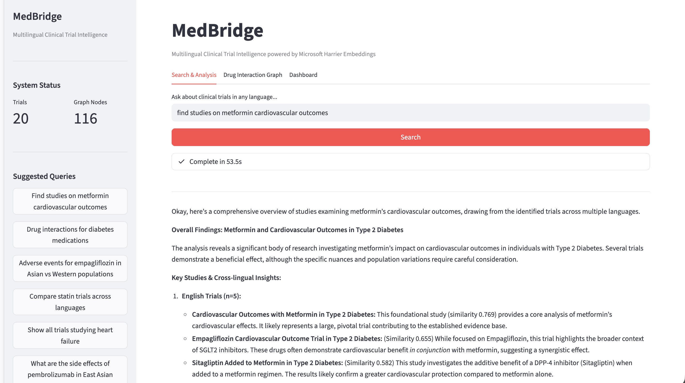
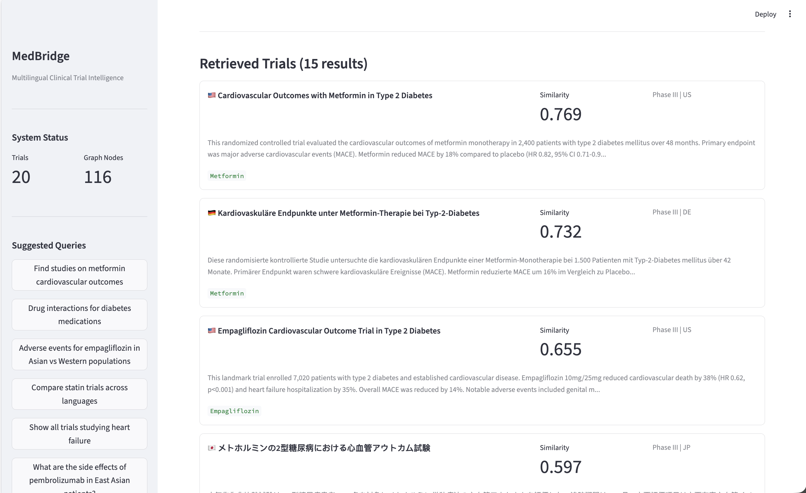
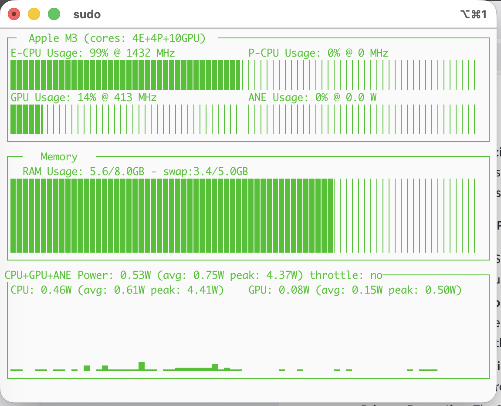

# MedBridge: Multilingual Clinical Trial Intelligence

**Everything runs locally. No cloud. No API keys. No data leaves your machine.**

A fully local, multi-agentic system for cross-lingual clinical trial discovery and analysis -- powered by [Microsoft Harrier](https://huggingface.co/microsoft/harrier-oss-v1-0.6b) multilingual embeddings, [Google Gemma 3](https://huggingface.co/bartowski/google_gemma-3-4b-it-GGUF) LLM, [Qdrant](https://qdrant.tech/) vector search, [FalkorDB](https://www.falkordb.com/) knowledge graph, and [LangGraph](https://github.com/langchain-ai/langgraph) multi-agent orchestration.

**Search "metformin cardiovascular outcomes" in English, get results from Chinese, Japanese, and German studies -- with zero translation.**

## Screenshots

### LLM-Powered Cross-Lingual Analysis
Gemma 3 4B analyzes retrieved trials across languages and synthesizes findings with cross-lingual insights -- all running locally on Metal GPU.



### Multilingual Trial Retrieval
Harrier embeddings retrieve relevant trials across languages (English, German, Japanese, etc.) ranked by semantic similarity -- no translation needed.



### Hardware Footprint (Apple M3, 8GB RAM)
Both models (Harrier + Gemma 3) run comfortably on an 8GB Apple Silicon Mac -- 5.6GB RAM, 14% GPU, under 1W average power draw at idle after inference.



## Why Local Matters

Clinical trial data is sensitive. MedBridge proves you can build a production-grade multilingual research intelligence system that runs entirely on a laptop -- no cloud dependencies, no data exfiltration risk, no API costs. Every component is open-source and runs on consumer hardware.

## What It Does

- **Cross-lingual semantic search** -- Query in any language, find trials in all 94 supported languages via Harrier embeddings
- **Drug interaction knowledge graph** -- Visualize drug relationships in FalkorDBLite with Cypher queries
- **Cross-cultural adverse event analysis** -- Compare safety signals across populations using Gemma 3 LLM analysis
- **Multi-agent orchestration** -- 5 LangGraph agents (supervisor, search, graph, analysis, ingestion) collaborate with visible trace
- **Vector + graph hybrid retrieval** -- Qdrant semantic search combined with FalkorDB graph traversal

## Tech Stack (100% Local, No Cloud Required)

| Component | Technology | Role |
|-----------|-----------|------|
| Embeddings | [Harrier-OSS-v1-0.6B](https://huggingface.co/microsoft/harrier-oss-v1-0.6b) (MPS GPU) | 94-language multilingual embeddings, 1024-dim, 32K context |
| LLM | [Gemma 3 4B-it](https://huggingface.co/bartowski/google_gemma-3-4b-it-GGUF) Q4_K_M (Metal GPU) | Intent classification, Cypher generation, analysis synthesis |
| Vector DB | [Qdrant](https://qdrant.tech/) (embedded, no server) | Semantic similarity search over trial embeddings |
| Graph DB | [FalkorDBLite](https://github.com/FalkorDB/FalkorDB) (embedded) | Drug interactions, trial relationships via Cypher |
| Agents | [LangGraph](https://github.com/langchain-ai/langgraph) (StateGraph) | Multi-agent orchestration with conditional routing |
| UI | [Streamlit](https://streamlit.io/) | Interactive web dashboard with search, graph viz, analytics |

**Runs entirely on a MacBook with Apple Silicon (M1/M2/M3/M4) and 8GB RAM.**

## Quick Start

### Requirements

- macOS with Apple Silicon (M1/M2/M3/M4)
- Python 3.12 (arm64 -- see note below)
- Xcode Command Line Tools: `xcode-select --install`

### Setup

```bash
# 1. Clone
git clone https://github.com/pankajarm/medbridge.git
cd medbridge

# 2. Create a native arm64 virtual environment
#    IMPORTANT: The venv MUST use arm64 Python, not x86_64/Rosetta.
#    PyTorch >= 2.4 only ships macOS arm64 wheels.
python3.12 -m venv .venv
source .venv/bin/activate

# Verify architecture (must say arm64, NOT x86_64):
python -c "import platform; print(platform.machine())"

# 3. Install dependencies
pip install -e .

# 4. Install llama-cpp-python with Metal GPU acceleration
#    If this fails with header errors, see Troubleshooting below.
CMAKE_ARGS="-DGGML_METAL=on" pip install llama-cpp-python

# 5. Copy environment config
cp .env.example .env

# 6. Download models (~4GB total: Harrier 1.5GB + Gemma 2.5GB)
python scripts/download_models.py

# 7. Generate sample data + build databases
python scripts/setup_databases.py

# 8. Launch web UI
streamlit run src/ui/app.py
```

Open http://localhost:8501 in your browser.

### CLI Mode

```bash
python main.py
```

## Memory Usage (8GB Mac)

| Component | RAM |
|-----------|-----|
| Harrier embeddings (MPS) | ~1.5 GB |
| Gemma 3 4B Q4 (Metal) | ~2.5 GB |
| Qdrant + FalkorDB | ~100 MB |
| Streamlit + Python | ~200 MB |
| **Total** | **~4.3 GB** |

Some swap usage is expected on 8GB machines when both models are loaded. Performance remains good thanks to unified memory and Metal GPU acceleration.

## Architecture

```
                    +-------------------------------------+
                    |         Streamlit Web UI             |
                    +--------------+----------------------+
                                   |
                    +--------------v----------------------+
                    |     LangGraph Supervisor Agent       |
                    +--+-------+-------+------+----------+
                       |       |       |      |
          +------------v-+ +--v-----+ +v-----v--+ +-------------+
          |  Ingestion   | |Semantic| | Graph    | |  Analysis   |
          |  Agent       | |Search  | | Query    | |  Agent      |
          +------+-------+ +--+-----+ +--+------+ +------+------+
                 |            |          |               |
    +------------v------------v--+  +----v--------------v----+
    |   Qdrant (embedded)       |  |  FalkorDBLite (embedded)|
    +---------------------------+  +-------------------------+
                 |                          |
    +------------v--------------------------v----+
    |      Harrier-OSS-v1-0.6B (MPS GPU)        |
    +--------------------------------------------+
```

## Demo Queries

Try these in the UI:

1. **Cross-lingual search**: "Find studies on metformin cardiovascular outcomes"
2. **Drug interactions**: "Drug interactions for diabetes medications"
3. **Cross-cultural analysis**: "Adverse events for empagliflozin in Asian vs Western populations"
4. **Trial comparison**: "Compare statin trials across languages"
5. **Oncology**: "What are the side effects of pembrolizumab in East Asian patients?"

## How Harrier Makes This Possible

Harrier-OSS-v1 maps text from 94 languages into a **single shared 1024-dimensional vector space**. This means:

- "Metformin" (English), "二甲双胍" (Chinese), "メトホルミン" (Japanese) are geometrically close
- Cross-lingual search is just cosine similarity -- no translation pipeline needed
- Entity resolution across languages works via embedding proximity

## Sample Data

The demo includes 20 synthetic clinical trial abstracts in 7 languages (EN, ZH, JA, DE, FR, ES, KO) covering:

- Type 2 Diabetes (Metformin, Sitagliptin, Empagliflozin)
- Cardiovascular (Atorvastatin, Rosuvastatin, Aspirin)
- Hypertension (Amlodipine, Losartan)
- Oncology (Pembrolizumab)
- Mental Health (Sertraline, Escitalopram)

With deliberate cross-population differences in adverse event rates for demo purposes.

## Troubleshooting

### `llama-cpp-python` fails to compile

If you see errors about `stdint.h`, `stdbool.h`, or `unknown type name 'uint16_t'` during `pip install llama-cpp-python`, you likely have stale C headers in `/usr/local/include/` from old Homebrew or MySQL installs:

```bash
# Check for conflicting headers
ls /usr/local/include/stdint.h /usr/local/include/stdbool.h 2>/dev/null

# Move them out of the way
sudo mv /usr/local/include/stdint.h /usr/local/include/stdint.h.bak
sudo mv /usr/local/include/stdbool.h /usr/local/include/stdbool.h.bak

# Retry
CMAKE_ARGS="-DGGML_METAL=on" pip install llama-cpp-python
```

### Python reports `x86_64` instead of `arm64`

Your venv was created with an x86_64 Python (Rosetta). Recreate it:

```bash
rm -rf .venv
# Use a universal or arm64 Python binary:
arch -arm64 python3.12 -m venv .venv
source .venv/bin/activate
```

### `unknown model architecture: 'gemma4'`

This means you have the Gemma 4 GGUF which `llama-cpp-python` doesn't support yet. MedBridge uses Gemma 3 4B instead. Re-run `python scripts/download_models.py`.

## Hardware Monitoring

To watch GPU/CPU/memory usage in real-time while running MedBridge:

```bash
pip install asitop
sudo asitop
```

This shows Apple Silicon CPU, GPU, ANE utilization and power draw -- similar to `nvitop` on Linux.

## License

MIT
